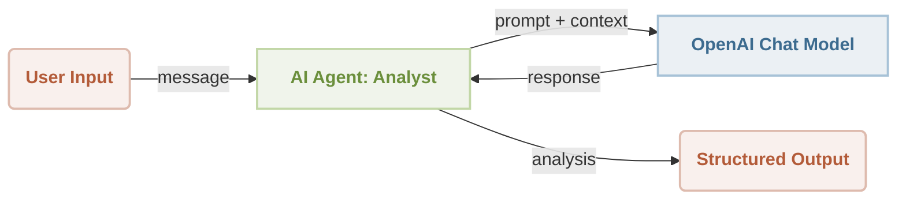
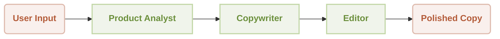

TypeScript is the most-used language on GitHub. Over 12 million repositories. More active projects than Python, Java, or C++. Yet when developers need to build AI agents, nearly every framework sends them to Python.

That mismatch has real costs. Teams maintaining TypeScript backends spin up separate Python services for agent logic, adding deployment complexity, duplicated infrastructure, and a language boundary that slows every iteration. The alternative -- wrapping raw LLM API calls in TypeScript yourself -- works for a demo, then collapses under the weight of multi-step workflows, error handling, and tool integration.

[AIGNE Framework](https://github.com/AIGNE-io/aigne-framework) closes that gap. It is an open-source, functional, TypeScript-first AI agent framework built for developers who want to write agents in the same language as the rest of their stack. No Python sidecar. No class inheritance hierarchies. Functional composition from the ground up.

This tutorial walks you through building your first agent and extending it into a multi-agent sequential workflow. Fifteen minutes, start to finish.

## What You Need Before Starting

- **Node.js 20+** installed (check with `node --version`)
- **An OpenAI API key** (or any supported provider -- AIGNE supports Gemini, Anthropic, Ollama, DeepSeek, xAI, and AWS Bedrock)
- **A terminal** and a text editor

That is the entire list. No Docker containers. No virtual environments. No framework-specific CLI to install first.

## Step 1: Set Up Your Project

Create a new directory and install the two packages you need: the core framework and a model provider.

```bash
mkdir my-first-agent && cd my-first-agent
npm init -y
npm install @aigne/core @aigne/openai
```

`@aigne/core` contains the agent runtime, workflow patterns, and orchestration layer. `@aigne/openai` provides the LLM integration. If you prefer a different provider, swap in `@aigne/anthropic`, `@aigne/gemini`, `@aigne/ollama`, or any of the other supported model packages.

Set your API key as an environment variable:

```bash
export OPENAI_API_KEY="your-key-here"
```

Create a file called `agent.ts`. This is where your agent lives.

## Step 2: Build a Single Agent

Think of an AIGNE agent like a function with a brain. You give it instructions (a system prompt), tell it what input to expect, and define what output key to produce. The framework handles the LLM call, message formatting, and response parsing.

Here is the architecture of what you are building:



Now the code. Open `agent.ts` and write:

```typescript
import { AIAgent, AIGNE } from "@aigne/core";
import { OpenAIChatModel } from "@aigne/openai";

// 1. Configure the LLM
const model = new OpenAIChatModel({
  apiKey: process.env.OPENAI_API_KEY,
});

// 2. Define the agent
const analyst = AIAgent.from({
  name: "ProductAnalyst",
  instructions: `You are a product analyst. Given a product description, identify:
- Three key features
- The primary target audience
- One unique selling point

Be specific. No filler.

Product description:
{{message}}`,
  inputKey: "message",
  outputKey: "analysis",
});

// 3. Create the AIGNE runtime and run
const aigne = new AIGNE({ model });

const result = await aigne.invoke(analyst, {
  message: "A TypeScript framework for building AI agents with functional composition, multi-LLM support, and built-in workflow patterns.",
});

console.log(result);
// Output:
// {
//   analysis: "**Key Features:**\n1. Functional composition architecture..."
// }
```

Three steps. Configure the model, define the agent, invoke it. The `AIAgent.from()` static method is the core creation pattern -- it takes a configuration object and returns a composable agent. The `inputKey` tells the agent which field from the input object to read. The `outputKey` names the field in the response object where the LLM's text output lands.

Run it with:

```bash
npx tsx agent.ts
```

You should see a structured analysis of the product description printed to your terminal. That is a working AI agent in under 20 lines of TypeScript.

## Step 3: Extend It -- Build a Sequential Multi-Agent Pipeline

A single agent is useful. Multiple agents working in sequence is where real applications start. AIGNE's `TeamAgent` with `ProcessMode.sequential` chains agents together so each one's output feeds into the next agent's context.

Here is what the pipeline looks like:



Create a new file called `pipeline.ts`:

```typescript
import { AIAgent, AIGNE, ProcessMode, TeamAgent } from "@aigne/core";
import { OpenAIChatModel } from "@aigne/openai";

const model = new OpenAIChatModel({
  apiKey: process.env.OPENAI_API_KEY,
});

// Agent 1: Extract key concepts
const conceptExtractor = AIAgent.from({
  instructions: `You are a marketing analyst. Given a product description, identify:
- Key features
- Target audience
- Unique selling points

Product description:
{{product}}`,
  outputKey: "concept",
});

// Agent 2: Write marketing copy from those concepts
const writer = AIAgent.from({
  instructions: `You are a marketing copywriter. Given product features, audience, and USPs,
compose compelling marketing copy that highlights these points.
Output should be around 150 words. Output the copy as a single text block.

Product description:
{{product}}

Product analysis:
{{concept}}`,
  outputKey: "draft",
});

// Agent 3: Polish the draft
const editor = AIAgent.from({
  instructions: `You are an editor. Given the draft copy, correct grammar,
improve clarity, ensure consistent tone, and make it polished.
Output the final copy as a single text block.

Product description:
{{product}}

Product analysis:
{{concept}}

Draft copy:
{{draft}}`,
  outputKey: "content",
});

// Chain them in sequence
const aigne = new AIGNE({ model });

const result = await aigne.invoke(
  TeamAgent.from({
    skills: [conceptExtractor, writer, editor],
    mode: ProcessMode.sequential,
  }),
  {
    product: "AIGNE Framework: a functional, TypeScript-first AI agent development framework with multi-LLM support and composable workflow patterns.",
  },
);

console.log(result.content);
```

Each agent in the `skills` array runs in order. The `conceptExtractor` produces a `concept` field. That field becomes available in the `writer`'s template context alongside the original `product` input. The `writer` produces a `draft` field, which the `editor` then refines into `content`. All context accumulates as the pipeline progresses.

Run it:

```bash
npx tsx pipeline.ts
```

You get polished marketing copy that passed through three specialized agents -- analyst, writer, editor -- without writing a single line of orchestration code. The `TeamAgent` and `ProcessMode.sequential` handle the data flow between agents for you.

Notice the pattern: each agent's `outputKey` becomes a template variable (`{{concept}}`, `{{draft}}`) accessible to downstream agents. This is the functional composition model at work. Agents are composable units. You add, remove, or reorder them by changing the `skills` array.

## Where to Go from Here

You have built two things: a standalone agent and a sequential pipeline. That covers a surprising number of real-world use cases. But AIGNE's TypeScript AI agent framework supports six workflow patterns total, and each unlocks different application architectures:

- **Concurrent** -- Run multiple agents in parallel and merge results. Useful for multi-dimensional analysis where each agent evaluates a different aspect simultaneously.
- **Router** -- Direct input to different specialized agents based on content. Think customer support triage: billing questions go to one agent, technical issues to another.
- **Handoff** -- Transfer control between agents mid-conversation. An agent can call a function that returns another agent, and the conversation seamlessly continues with the new specialist.
- **Reflection** -- An agent produces output, a reviewer agent evaluates it, and if the review fails, the original agent tries again. This is how you build self-correcting pipelines.
- **Orchestration** -- Coordinate multiple agents in complex, dynamic workflows where the control flow depends on intermediate results.

AIGNE also supports the [Model Context Protocol (MCP)](https://github.com/AIGNE-io/aigne-framework/tree/main/examples/mcp-server), which lets agents connect to external tools and services through a standardized interface. Need your agent to query a database, browse the web, or interact with GitHub? MCP handles that without custom integration code.

For teams deploying agents into production, AIGNE integrates with the broader [ArcBlock](https://www.arcblock.io) ecosystem. Agents built with AIGNE can be packaged as Blocklets -- modular, deployable units with built-in identity, monitoring, and access control. And if you are building user-facing applications, platforms like [MyVibe](https://myvibe.so) let you connect agent outputs to live, deployed interfaces without a separate frontend engineering cycle.

## Key Takeaways

- **AIGNE lets you build production AI agents in TypeScript** using `AIAgent.from()` for single agents and `TeamAgent` with `ProcessMode.sequential` for multi-agent pipelines -- no Python, no class hierarchies, no boilerplate orchestration.
- **Functional composition is the core pattern.** Each agent is a composable unit with defined inputs and outputs. You chain them by adding to a `skills` array. Reordering, adding, or removing agents takes one line.
- **The framework scales from single agents to multi-agent systems** with six built-in workflow patterns, MCP support for external tools, and multi-LLM flexibility across eight providers -- all from the same `@aigne/core` package.
