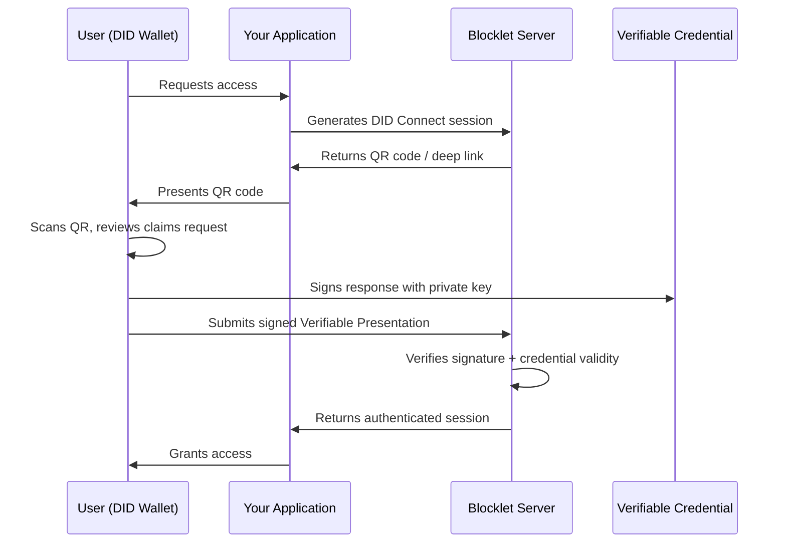

# How to Replace Password Databases with DID Wallets in Your Enterprise Auth Stack

Your password database is a liability dressed up as a security feature. IBM's 2025 Cost of a Data Breach Report pegs the average breach at $4.44 million, but when compromised credentials are the initial attack vector, that number climbs to $4.67 million per incident. The Verizon 2025 DBIR confirmed stolen credentials now drive 22% of all breaches, making them the single most common entry point. And here is the number that should keep you up at night: 94% of passwords exposed in breaches between 2024 and 2025 were reused across multiple accounts.

You are not protecting credentials. You are warehousing attack surface.

## The Password Database Is Architectural Debt

Every enterprise password store follows the same pattern: collect a secret from the user, hash it, store it centrally, and hope your infrastructure outlasts the attacker's patience. That model creates a honeypot. The more users you onboard, the more valuable the target becomes. Credential stuffing now accounts for 19% of all enterprise authentication attempts on a median day, spiking to 25% in large organizations, according to SSO provider log analysis cited in the 2025 DBIR.

The alternative is not another vault or another layer of MFA on top of a broken foundation. The alternative is removing the password database from the equation entirely. Decentralized Identity (DID) flips the model: instead of your server holding the user's secret, the user holds their own cryptographic proof. Your server verifies it. Nothing to steal, nothing to store, nothing to breach.

ArcBlock's DID Wallet and DID Connect protocol implement exactly this pattern. A DID wallet for business replaces centralized credential storage with W3C-compliant Decentralized Identifiers and Verifiable Credentials, all running on self-hostable infrastructure through Blocklet Server.

## Step 1: Understand the Auth Flow Shift

Before writing a line of code, you need to see how the architecture changes. Traditional auth has a bidirectional trust problem: the user trusts your server to store their password safely, and your server trusts the user to keep that password private. Both assumptions fail regularly.

DID-based auth eliminates the shared secret. Here is what happens when a user authenticates with DID Connect:



Three things to notice. First, the user's private key never leaves their device. Second, your server never stores a password or password hash. Third, the verification is cryptographic, not a string comparison against a database row. There is no credential database to breach because there is no credential database.

The QR code serves as the bridge between your application and the user's DID Wallet. When the user scans it, they see exactly what claims your application is requesting (name, email, a specific Verifiable Credential) and they approve or deny that request on their device. This is consent-driven authentication, not credential surrender.

## Step 2: Implement DID Connect in Your Application

ArcBlock provides the `@arcblock/did-connect-react` SDK for front-end integration and `@arcblock/did-auth` for server-side session handling. Here is how a working implementation looks.

**Server-side: Express handler with DID Auth**

```javascript
const { WalletAuthenticator, WalletHandlers } = require('@arcblock/did-auth');
const { Wallet } = require('@ocap/wallet');
const TokenStorage = require('@arcblock/did-auth-storage-nedb');

// Initialize from your Blocklet Server environment
const wallet = Wallet.fromJSON(process.env.APP_WALLET_SK);

const authenticator = new WalletAuthenticator({
  wallet,
  baseUrl: process.env.BASE_URL,
  appInfo: {
    name: 'Your Enterprise App',
    description: 'Passwordless enterprise authentication',
    icon: 'https://your-app.com/logo.png',
  },
  chainInfo: {
    host: process.env.CHAIN_HOST,
    id: process.env.CHAIN_ID,
  },
});

const tokenStorage = new TokenStorage({ dbPath: './data/auth-tokens.db' });
const handlers = new WalletHandlers(authenticator, tokenStorage);

// Attach to Express — replaces your /login POST route
handlers.attach({
  app: expressApp,
  action: 'login',
  claims: {
    profile: () => ({
      fields: ['fullName', 'email'],
      description: 'Provide your identity to sign in',
    }),
  },
  onAuth: async ({ userDid, userPk, claims, updateSession }) => {
    const profile = claims.find((c) => c.type === 'profile');

    // No password check. Signature already verified by the protocol.
    // userDid is the authenticated decentralized identifier.
    await updateSession({
      user: {
        did: userDid,
        name: profile.fullName,
        email: profile.email,
      },
    });
  },
});
```

**Client-side: React session provider**

```javascript
import React from 'react';
import { createAuthServiceSessionContext } from '@arcblock/did-connect-react/lib/Session';

const { SessionProvider, SessionContext } = createAuthServiceSessionContext();
export const useSession = () => React.useContext(SessionContext);

export default function App() {
  return (
    <SessionProvider>
      <EnterpriseApp />
    </SessionProvider>
  );
}

function EnterpriseApp() {
  const { session } = useSession();

  if (session.loading) return <div>Verifying identity...</div>;

  if (session.user) {
    return (
      <div>
        <p>Authenticated: {session.user.did}</p>
        <button onClick={() => session.logout()}>End Session</button>
      </div>
    );
  }

  // session.login() triggers the DID Connect QR code flow
  return <button onClick={() => session.login()}>Sign in with DID Wallet</button>;
}
```

That is the entire auth layer. No bcrypt. No password reset flow. No "forgot password" email pipeline. No salting strategy debates. The `SessionProvider` manages the DID Connect handshake, QR code presentation, and session lifecycle. The server-side handler verifies the cryptographic proof and establishes the session.

You deploy this on Blocklet Server, ArcBlock's self-hostable infrastructure platform. Everything runs as a Blocklet, which means your authentication service lives on infrastructure you control, not a third-party SaaS you hope stays solvent and unbreached.

## Step 3: Harden and Extend for Production

Removing the password database is the foundation. Here is how to build on it for enterprise-grade deployment.

**Verifiable Credentials for access control.** DID Connect does not stop at login. You can request specific Verifiable Credentials during the authentication flow: employee ID credentials, department credentials, compliance certifications. The claims configuration in the handler above accepts any VC type. Your RBAC layer checks credential attributes instead of querying a permissions database.

**Audit without exposure.** Every DID Connect session produces a verifiable proof chain. The user's DID is a persistent pseudonymous identifier. You get full audit trail capability without storing personal data. This aligns with GDPR data minimization requirements because you are verifying claims, not collecting and retaining credentials.

**Multi-chain support.** ArcBlock's DID Connect SDK supports authentication across multiple blockchain networks from a single endpoint. If your enterprise operates across different chain environments, you configure one handler, not one per chain.

**Self-hosted sovereignty.** Blocklet Server runs on your infrastructure. You can deploy it on-premise, in your private cloud, or in a hybrid configuration. The authentication service, the session storage, and the verification logic all live behind your firewall. You can pair this with tools built on ArcBlock's broader ecosystem, whether that is building AI-driven workflows with the [AIGNE framework](https://aigne.io) or prototyping internal tools through [MyVibe](https://myvibe.so).

## Key Takeaways

- **Eliminate the target.** Replacing password databases with DID-based authentication removes the single most breached asset class in enterprise security. No stored credentials means no credential database to breach.

- **Shift proof to the edge.** With a DID wallet for business authentication, users hold their own cryptographic keys. Your server verifies signatures rather than storing secrets, cutting breach impact and reducing compliance burden.

- **Deploy on your terms.** ArcBlock's Blocklet Server lets you self-host the entire authentication stack. DID Connect, Verifiable Credentials, and session management all run as Blocklets on infrastructure you own and control.
