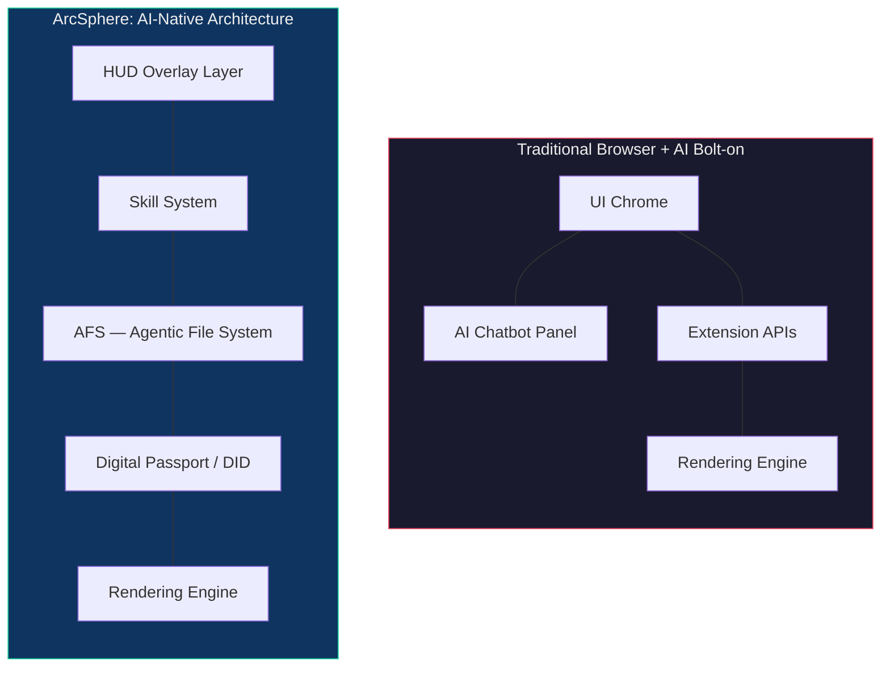

Every major browser shipped an AI feature in 2025. A summarizer here. A chatbot panel there. Tab grouping powered by a language model. And every single one of them welded that capability onto an architecture designed in 2008.

That is not an AI native browser. That is a legacy browser wearing a costume.

The difference matters. It matters for what your browser can do, how it surfaces information, and whether AI is a bolted-on assistant you have to invoke or a layer that permeates everything you see and touch. ArcSphere, built by [ArcBlock](https://www.arcblock.io), is designed around the second model. Understanding why requires pulling apart what "AI-native" actually means at an architectural level.

## The Architecture Gap: Layers vs. Patches

Most browsers follow a familiar stack: rendering engine at the bottom, extension APIs in the middle, UI chrome on top. When a vendor adds AI, they patch it into the extension layer or drop a panel into the chrome. The AI has no awareness of context across tabs. It cannot compose actions. It sits in a silo, waiting to be asked.

An AI native browser inverts this. AI is not a feature living inside the browser. The browser is a surface living inside the AI layer. Here is the structural difference:

In the traditional model, AI is an appendage. In ArcSphere's model, the Skill System, the Agentic File System, and the HUD overlay are load-bearing layers. Remove them and the browser does not degrade gracefully. It stops being itself.

That distinction — AI as structure vs. AI as accessory — is the line between native and bolted-on.

## Three Capabilities That Define the Category

An AI native browser needs more than a chat interface. It needs three things legacy browsers cannot retrofit without rebuilding from scratch.

### 1. A Skill System, Not an Extension Store

Browser extensions are static code bundles. They do one thing. They don't talk to each other. They can't be composed into workflows.

ArcSphere replaces this model with a Skill System. The Skill Browser lets you discover and install AI capabilities — not frozen code packages, but composable actions. The Skill Composer then lets you chain those Skills into multi-step workflows. A research task that requires pulling data, summarizing it, and formatting a report becomes a composed sequence, not three separate tools running in isolation.

This is the same composability principle behind the [AIGNE framework](https://aigne.io), applied at the browser layer. Skills are the unit of intelligence. Composition is how they scale.

### 2. An Agentic File System (AFS), Not a Cache

Traditional browsers store your activity in history logs, cookie jars, and cache directories. None of it is structured. None of it is queryable in a meaningful way. Your browser has amnesia by design.

AFS — the Agentic File System — treats your browsing context as structured, persistent data. The AFS UI visualizes this context directly, so instead of digging through a flat history list, you see relationships between sessions, topics, and actions. Context becomes navigable. The browser remembers not just where you went, but what you were doing and why it mattered.

This is the difference between a file cabinet and a knowledge graph. One stores paper. The other understands connections.

### 3. A HUD, Not a Chatbot

Here is where most AI browser integrations fail hardest. They interrupt. A chatbot panel demands you stop what you're doing, type a question, read a response, then switch back to your task. That is a context switch disguised as a feature.

ArcSphere uses a HUD design philosophy — ambient, transparent overlays that surface intelligence without pulling you out of flow. The Action Ring, a radial touch menu, puts AI actions one gesture away. No panel. No sidebar. No "let me open the AI and ask it something." Intelligence shows up where your eyes already are.

Spatial Tab Navigation reinforces this. Instead of a linear tab strip that collapses into illegibility after twelve tabs, ArcSphere maps your tabs onto an 8x8 grid rendered as a 3D sphere. You see your workspace spatially. You navigate by position and context, not by squinting at truncated page titles.

On both iOS and Android, these interactions are built for touch. The Action Ring is a radial gesture. The spatial grid is a swipe. AI actions are physical, not buried in menus.

## What This Actually Means for You

Strip away the architecture talk and three concrete things change.

**Your tools compose.** Skills chain together. A workflow that previously required four browser extensions, two web apps, and manual copy-paste between them becomes a single composed sequence in the Skill Composer. Fewer tabs. Fewer context switches. Fewer dropped threads.

**Your context persists.** AFS means your browser accumulates useful structure over time rather than dumping everything into a flat, unsearchable history log. Come back to a research thread next week and the context is there — organized, visual, navigable through the AFS UI.

**Your attention stays intact.** The HUD philosophy means AI surfaces information where you are, not where it wants you to go. The Action Ring and spatial navigation are designed to keep you in flow rather than routing you through dialog boxes and chat panels.

ArcSphere also ships with a Digital Passport built on decentralized identity (DID), which means passwordless authentication across sites. One fewer friction point, one fewer password manager tab.

For those building AI-powered products and experiences, the ecosystem connects outward. [MyVibe](https://myvibe.so) handles the creation layer. AIGNE handles the framework layer. ArcSphere handles the surface layer — the place where users actually interact with all of it.

## Key Takeaways

- **AI-native means AI as architecture, not AI as add-on.** If you can remove the AI features and the browser still works the same way, it was never native. ArcSphere's Skill System, AFS, and HUD are structural — not decorative.
- **Composability is the unlock.** Extensions are dead ends. Skills that chain into workflows through the Skill Composer change what a browser can do at a fundamental level.
- **The best AI is invisible.** A chatbot panel is a 2023 solution. A HUD that surfaces intelligence in context, with interactions like the Action Ring designed for touch, is where the category is heading.

The browser has been a static window for two decades. Making it an AI native browser is not about adding a panel. It is about rebuilding the layers underneath so intelligence is structural, persistent, and ambient. That is the bet ArcSphere is making. And bolting a chatbot onto Chrome is not going to get there.
